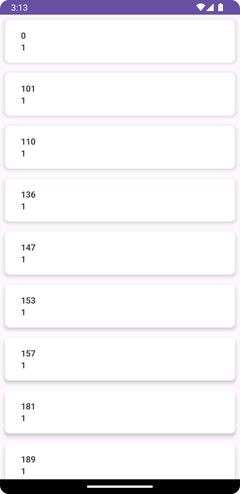

# FetchRewards
## Overview
Welcome to Fetch Rewards Android App! This app utilizes Retrofit, MVVM architecture to fetch data from an API and display a list of items.

## Features
- Fetches data from a remote API using Retrofit.
- Utilizes MVVM architecture for a clean and organized codebase.
- Displays data in the list format by using recyclerview.

## Screenshots

 

## Installation
To install Fetch Rewards Android App on your device, follow these steps:

 **1. Clone the repository to your local machine.**
 
 **2. Open the project in Android Studio.**
 
 **3. Build and run the project on an Android device or emulator.**

## Usage
Once the app is installed on your device, follow these steps to use it:

- Open the app from your device's home screen.
- The app will fetch data from the API and display a list of elements.
- Scroll through the list to view all the elements.

### Dependencies

**Retrofit**

**Coroutines**

**View Model**

## Contributing
Contributions to My Awesome Android App are always welcome! If you'd like to contribute, please follow these guidelines:

Fork the repository.
Create a new branch for your feature or bug fix.
Make your changes and test thoroughly.
Feel free to customize it further based on your app's specific details and requirements!
